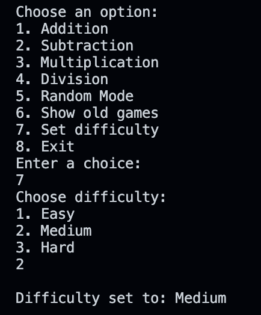

# cSharpAcademy-MathGame

This is my submission for the cSharpAcademy Math Game project found here: https://thecsharpacademy.com/project/53/math-game

1. Project Description
  - It's a small math game where a user can choose a math type (addition, subtraction, multiplication, division) and answer 5 questions.
  - Built with C#/.Net 8
  - I followed one of the cSharpAcademy's videos to get the project set up (that's where the GameLogic class comes from). The rest of it is my own.

2. Usage
  - Follow the instructions and away you go
  - i.e. Select from the menu to perform addition, subtraction, multiplication, or division.

    

3. Features
   - Difficulty settings can be chosen from the menu. Harder difficulties expand the range of usable numbers: 1-10 for easy, 1-30 for medium, 1-100 for hard.
   - Random mode chooses an operator for you (+, -, *, /)
   - Supports addition, subtraction, multiplication, and division.
   - Random number generation for math problems.
   - Score tracking for correct and incorrect answers.
   - Game history available for review (old questions with correct answers are displayed)
   - Time records how many seconds player took to finish

4. More to do
  - Would refine timer for minutes/seconds if the player took a long time
  - Add more win/loss messages
  - Build a GUI and export it to Android using MAUI

5. Questions & Comments
  - I'm not sure about the programs's structure. I initially had one GameLogic class (which I got from your video) then I wrote Program.cs as procedural code with conditional statements. It worked but I wanted to challenge myself with OOP so I added a Game class that handles the current game. However I'm not sure if it's organized well.
  - Would this have been better as a single Game class?
  - Which files should I have added to gitignore? This is my first C# program.
  - Any suggestions on how to clarify my code is greatly appreciated! Program structure is by far the most difficult part for me. Thanks!
  - This is just the kind of project I need to get me out of tutorial hell! I'm looking forward to getting better at this.

Created by Andy Harris - [GitHub Profile](https://github.com/harris-andy)